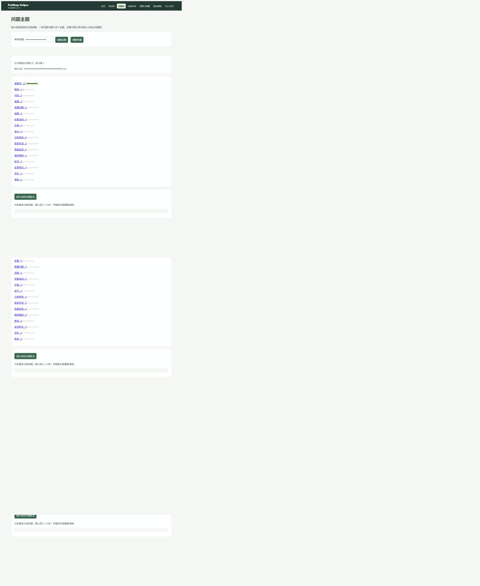

# 分类补齐实施与验收

2026-09-28。III-1—III-7代码已实施并完成离线/隔离MySQL验证，真实模型质量尚未验收。

| 范围 | 已验证行为 | 实际质量待办 |
|---|---|---|
| 清洗 | 保留来源ID，脱敏/去重，失败保留原文；5条标注样例 | 真实语料清洗人工抽查 |
| 增强 | 固定划分，仅train，缓存绑定版本；变体须人工review，val/test不变 | 真实模型生成及语义批准 |
| 诊断 | micro/macro P/R/F1、逐类混淆计数/红线、脱敏漏标/多标错例 | 实际测试集红线达标 |
| 服务 | health/classify元数据；17类有限分数/合法标签/长度/版本校验；导出报告必须绑定模型 | 本项目真实ONNX包与8110服务 |
| 持久化 | 可重跑迁移；来源锁/唯一约束；分类和成功审计同事务；并发跳过不计入本次预测 | 真实池批次、升级与SQL对账 |
| 主题 | 聚合与独立问题数分开；稳定分页；脱敏；审核关联 | 真实分类分布 |
| 验收后台 | 固定九项产物；missing/failed/pending/stale明确显示；不接受任意路径 | 九项真实数据/模型产物 |

本轮独立评审的4项Important已修复并回归：并发跳过统计、增强未经批准、黄金闸缺预标指纹、批次审计非原子；另补整体P/R。纳入249项集成检查通过结果，不能把该数量等同模型准确率。

浏览器用专用合成库，22个已分类问题共23个标签，1个未分类；第一页20项、第二页2项无重叠，手机号遮蔽，换页不转移凭据。



## 恢复命令

工作目录、环境配置见[DEPLOY](DEPLOY.md)。以下迁移仅建缺失表，不生成真实分类结果：

```powershell
.\.venv\Scripts\python.exe -X utf8 -m scripts.ch10.migrate_topics
```

真实语料获授权并通过黄金预标/人工审核、每类原始样本要求后，运行已批准的build_dataset、train、阈值重演、export_onnx、evaluate流水线。增强审核文件为JSONL，每行形如 `{"review_id":"aug-实际ID","approved":true}`（拒绝用false）；待审核不可训练。不要改动test以追求通过率。训练/验收详细顺序见[IV-2计划](superpowers/plans/2026-09-28-mewhelp-alignment-acceptance-plan.md)。

真实模型包就绪后：

```powershell
$env:CH10_MODEL_DIR='data/ch10/onnx'
.\.venv\Scripts\python.exe -m uvicorn scripts.ch10.serve:app --host 127.0.0.1 --port 8110
# 第二终端，配置相同服务地址/目标隔离库
.\.venv\Scripts\python.exe -X utf8 -m scripts.ch10.smoke_service
.\.venv\Scripts\python.exe -X utf8 -m scripts.ch10.classify_pool --limit 500 --min-batch 10
```

批次第二次运行应不重复；模型升级需要显式 `--reclassify`。目前实际运行smoke_service得到pending_compute（缺模型包），退出非0；未调用真实分类器，不宣称passed。
